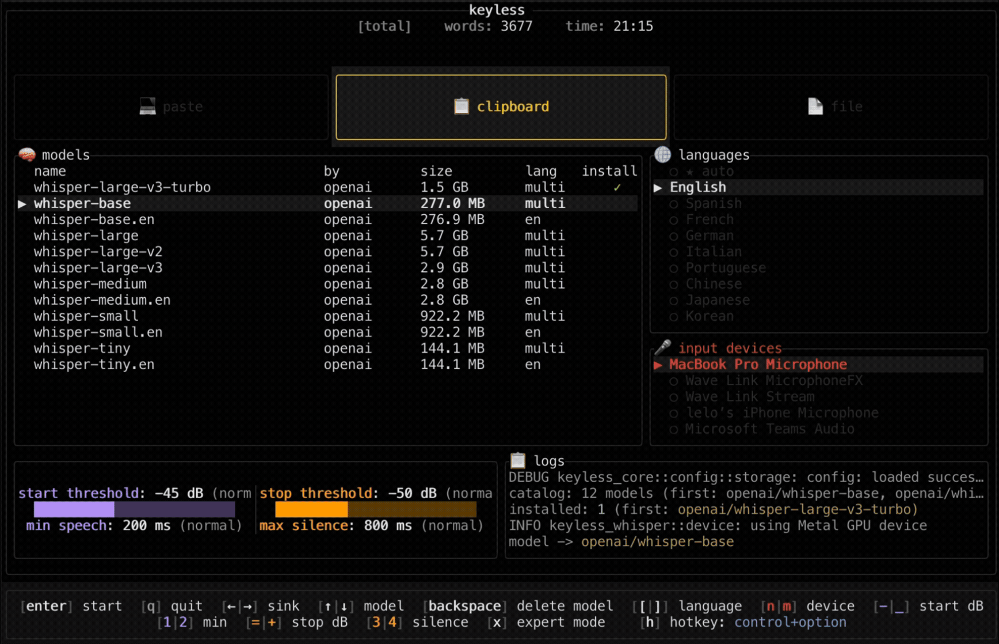

<div align="center">


# keyless

**Privacy-first, real-time speech-to-text dictation**

Local-only voice transcription built in Rust. Hold a hotkey, speak, release - your words appear as text.

Powered by OpenAI's Whisper.

[](https://github.com/hate/keyless/actions/workflows/docs.yml)
[](https://github.com/hate/keyless/releases)
[](LICENSE)
[](https://www.rust-lang.org/)

[Website](https://keyless.sh) • [Features](#-features) • [Quick Start](#-quick-start) • [How It Works](#-how-it-works) • [Tech Stack](#-tech-stack) • [Contributing](CONTRIBUTING.md)

</div>


## Motivation

I built keyless to create a fast, private dictation workflow I can rely on every day, entirely in Rust. That means:

- Audio capture and DSP in `keyless-audio` (FFT‑based EQ, hysteresis VAD; resampling handled in `keyless-whisper` via rubato)
- On‑device ML inference in `keyless-whisper` (Candle/Whisper model loading, tokenizer, quantized GGUF support)
- Concurrency and orchestration in `keyless-runtime` (mpsc channels, phased startup artifacts, non‑Send `cpal::Stream` boundaries)
- A responsive terminal UI in `keyless` (ratatui overlays, hotkeys, previews, logs)
- A modern desktop app in `keyless-desktop` (Tauri v2 + React, system tray, overlay windows, full settings UI)
- Robust downloads and configuration in `keyless-models` and `keyless-core` (reqwest resume/backoff, typed caches, serde config, `KeylessError`)

The goal is a tool you can trust: local and no accounts. Choose the interface that fits your workflow—terminal or desktop.

## 📸 Demos

**Desktop App (Beta):**


**TUI (Terminal) Version:**



## ✨ Features

**Privacy-First Architecture**
- 100% local processing - no cloud, no API keys necessary, no network needed after model download
- All audio and transcription stays on your device
- Open-source and auditable

**Real-Time Transcription**
- Live preview mirrors the Final by running the same voiced‑mask pipeline incrementally (~120–200 ms cadence)
- Push-to-talk for precise control
- Full, high‑quality final transcription on release

**Smart Quality**
- Per‑unit silence‑drop (RMS + Whisper no_speech_prob) and overlap dedupe
- Temperature fallback decoding
- Language auto-detection (99 languages supported)
- Quality metrics tracking (confidence, compression ratio)

**Performance Optimized**
- GPU acceleration (Metal on macOS, CUDA on Linux/Windows)
- High-quality resampling via rubato (supports all device sample rates)
- Auto mic rate (device default; prefers 48 kHz; caps high rates)

## 🚀 Quick Start

### Desktop App (Beta) 🎉

**Download desktop app:**
[Releases](https://github.com/hate/keyless/releases) - Look for `keyless-desktop-*` assets

**Build desktop app from source:**

**Prerequisites:**
- [Node.js](https://nodejs.org/) (LTS version recommended)
- [pnpm](https://pnpm.io/) (version 10+)
- [Rust](https://www.rust-lang.org/) (stable toolchain)
- [Tauri CLI](https://tauri.app/v1/guides/getting-started/prerequisites) - Install with `cargo install tauri-cli` or `pnpm add -D @tauri-apps/cli`

**Build steps:**
```bash
git clone https://github.com/hate/keyless.git
cd keyless/keyless-desktop

# Install dependencies
pnpm install

# Development mode
pnpm tauri dev

# Build release
pnpm tauri build
```

**First run:** 
- Grant microphone and accessibility permissions when prompted
- Download a Whisper model from the Models screen
- Configure your hotkey and output mode in Settings
- Press your configured hotkey to start dictating

**Note**: On macOS, Accessibility permission is required for paste mode (keystroke simulation) and global hotkey detection. The app will guide you through granting permissions on first launch.

### TUI (Terminal) Version

**Download binary:**
[Releases](https://github.com/hate/keyless/releases) - Look for `keyless-*` assets (not desktop)
```bash
# Download from releases page
# Extract and run
./keyless  # macOS/Linux
# or
keyless.exe # Windows
```

**Build from source:**
```bash
git clone https://github.com/hate/keyless.git
cd keyless
cargo build --release
./target/release/keyless
```

**Install via Cargo (from git):**
```bash
# Latest main
cargo install --git https://github.com/hate/keyless --package keyless --locked

# Or pin a release tag
cargo install --git https://github.com/hate/keyless --tag tui-v0.3.0 --package keyless --locked

# Update existing install
cargo install --git https://github.com/hate/keyless --package keyless --locked --force

# Enable CUDA (Linux/Windows with NVIDIA)
cargo install --git https://github.com/hate/keyless --package keyless --locked --features cuda

# After install, ensure ~/.cargo/bin is on PATH
```
Note: CUDA is an optional feature flag on the same install; use `--features cuda` when building on an NVIDIA system with the CUDA toolkit installed. macOS Metal is enabled automatically by target.

**First run:** Downloads Whisper model 
**Usage:** Press Control+Option (configurable) to start dictating

## 🔧 How It Works

Both the TUI and Desktop app share the same core audio processing pipeline. The only difference is the user interface layer—the TUI uses a terminal-based interface while the Desktop app uses a modern GUI with overlays.

### High-Level Flow

keyless uses a **multi-threaded pipeline** to process your voice in real-time (shared by both TUI and Desktop):

1. **Capture** - Microphone capture (auto: device default; prefers 48 kHz; caps high rates)
2. **Process** - Automatic resample to 16 kHz with rubato, VAD gate, EQ analysis  
3. **Transcribe (Preview)** - Every ~120–200 ms, run the same voiced‑mask pipeline on the current buffer (≤10s units, 0.5s overlap), reusing cached unit texts via a ~128 ms tail hash; preview text matches what Final would be now
4. **Transcribe (Final)** - On release, run the same unitized pipeline on the full segment; stitch units with overlap dedupe; per‑unit silence‑drop prevents stray boilerplate
5. **Deliver** - Text appears in your app (paste/clipboard/file)

All processing happens on your device using Rust and Candle ML.

```
┌─────────────┐
│  Microphone │
└──────┬──────┘
       │ PCM audio (auto rate; prefers 48 kHz)
       ▼
┌─────────────────────────────┐
│  Audio Thread (cpal)        │
│  • Captures ~100ms frames   │
│  • Thread-safe channel      │
└──────┬──────────────────────┘
       │ Audio frames
       ▼
┌─────────────────────────────┐
│  Worker Thread              │
│  • Resample to 16 kHz       │
│  • VAD gating               │
│  • EQ spectrum              │
│  • Accumulation buffer      │
└──────┬──────────────────────┘
       │ Gated 16kHz audio
       ▼
┌─────────────────────────────┐
│  Inference Thread (Whisper) │
│  • Mel spectrogram          │
│  • Encoder (audio→features) │
│  • Decoder (features→text)  │
│  • Event emission           │
└──────┬──────────────────────┘
       │ Transcription events
       ▼
┌─────────────────────────────┐
│  Output Sink                │
│  • Paste (keystroke sim)    │
│  • Clipboard                │
│  • File append              │
└─────────────────────────────┘
```

<details>
<summary><b>Click to see detailed technical implementation</b></summary>

### Technical Implementation

#### 1. **Audio Capture** (`keyless-audio`)

**Technology:** [cpal](https://github.com/RustAudio/cpal) (Cross-Platform Audio Library)

**Process:**
- Uses device default input rate automatically; prefers 48 kHz when available; caps excessively high defaults (e.g., ≤48 kHz)
- Produces ~100 ms frames (computed from the chosen sample rate)
- Bounded channel (capacity: 64 frames) introduces backpressure to prevent unbounded memory; realtime callback uses non-blocking try_send so audio never blocks (overflow frames may be dropped)

**Why prefer/cap around 48 kHz?**
- Many microphones support 48 kHz and it offers smoother EQ visualization
- We resample to 16 kHz using rubato (high‑quality FFT‑based), so recognition accuracy is independent of device rate
- Capping avoids unnecessary CPU load from extreme defaults (e.g., 96/192 kHz)

**Threading:**
- OS audio callback runs on realtime thread (must not block!)
- Frames forwarded to worker thread via channel
- Separation prevents audio glitches even if processing is slow

#### 2. **Signal Processing** (`keyless-audio`, `keyless-whisper`)

**Resampling (arbitrary rate → 16 kHz):**
- [rubato](https://github.com/HEnquist/rubato) FFT‑based resampler
- Supports all device sample rates (16k, 32k, 44.1k, 48k, 96k)
- High‑quality sinc interpolation with anti‑aliasing
- No assumptions about microphone capabilities (works with your device rate)

**EQ Visualizer:**
- 1024-point FFT with Hann window
- 64 log-spaced bands (120 Hz to configured Nyquist); EQ runs pre-resample (typically 24 kHz Nyquist at 48 kHz)
- Auto-sensitivity via max normalization for consistent bar heights
- Attack/decay smoothing for fluid animation
- Tunable parameters: noise reduction, gamma curve, window scaling

**VAD (Voice Activity Detection):**
- Hysteresis‑based gate (default: start: −45 dBFS RMS, stop: −50 dBFS RMS; configurable)
- Minimum duration (200 ms) prevents brief clicks
- Maximum silence (800 ms) allows natural pauses
- Prevents Whisper from receiving silence/background noise

#### 3. **Transcription Engine** (`keyless-whisper`)

**What is Whisper?**
[OpenAI Whisper](https://github.com/openai/whisper) is a state-of-the-art speech recognition model trained on 680,000 hours of multilingual data. It achieves human-level accuracy and supports 99 languages.

**Our Implementation:**
- **ML Framework:** [Candle](https://github.com/huggingface/candle) (Hugging Face's Rust ML library)
- **Models:** Whisper tiny/base/small (multilingual or .en variants)
- **Runs locally:** No API calls, all inference on-device

**Pipeline:**
1. **Preprocessing:**
   - Convert 16kHz PCM → Mel spectrogram (80 mel bins)
   - **Voiced span unitization**: Split audio into ≤10s voiced units with 0.5s overlap using hysteresis-based detection
   - Mel frames capped to `2 × max_source_positions` to prevent encoder panics

2. **Encoder:**
   - Processes mel spectrogram → audio features
   - Runs once per unit (cached for language detection and preview reuse)

3. **Decoder (Autoregressive):**
   - Token generation with temperature-based sampling
   - Per-unit silence-drop (RMS + `no_speech_prob`) prevents hallucinations
   - Temperature fallback (tries 0.0, 0.2, ..., 1.0 until quality acceptable)
   - Quality metrics: avg_logprob, compression_ratio

4. **Post-processing:**
   - Filter special tokens (SOT, EOT, language tags)
   - Stitch units together with overlap dedupe
   - Deliver Final event to output sink

**Performance Optimizations:**
- Automatically selects the best mic rate
- Single encoder pass (language detection reuses features)
- Quantized model support (GGUF via Candle's quantized loader, 3–4× faster)

**Device Selection:**
- Prefers GPU backends when compiled and available (Metal on macOS, CUDA on NVIDIA) with CPU fallback
- Selection is automatic among available backends; no manual configuration needed

#### 4. **Output Delivery** (`keyless-output`)

**Three sink modes:**

**Paste:**
- Uses [enigo](https://github.com/enigo-rs/enigo) for cross-platform keystroke simulation
- Simulates typing character-by-character
- Appears in focused application
- Requires Accessibility permission on macOS

**Clipboard:**
- Uses [arboard](https://github.com/1Password/arboard) for cross-platform clipboard access
- Copies transcription to system clipboard
- User manually pastes with Cmd+V/Ctrl+V

**File:**
- Appends to specified file path
- Each transcription on new line
- Useful for logging or feeding to other tools

#### 5. **Event-Driven Coordination** (`keyless-runtime`)

**Channel-based communication:**
```rust
pub struct PipelineChannels {
    pub tx_level: SyncSender<u16>,      // RMS level → TUI/Desktop
    pub tx_log: SyncSender<String>,     // Logs → TUI/Desktop
    pub tx_spec: SyncSender<Vec<u16>>,  // EQ bars → TUI/Desktop
    pub tx_preview: SyncSender<String>, // Preview text → TUI/Desktop
    pub tx_vad: SyncSender<bool>,       // VAD state → TUI/Desktop
}
```

**Key design decisions:**
- Bounded channels with backpressure (prevents memory bloat)
- Non-blocking sends (audio never blocks on slow consumers)
- Separate worker threads (audio, inference, UI never block each other)

**Push-to-Talk:**
- Global hotkey listener (using platform-specific APIs)
- `Arc<AtomicBool>` for thread-safe hold state
- Atomic flag checked in audio callback (realtime-safe)

### Error Handling Philosophy

**Project-wide `KeylessError` enum:**
```rust
pub enum KeylessError {
    Audio(String),
    Whisper(String),
    Output(String),
    Config(String),
    Io(#[from] io::Error),
    // ...
}
```

**Benefits:**
- Type-safe error handling (pattern matching)
- Automatic `io::Error` conversion
- Consistent error messages across all 8 crates
- No panics (zero `unwrap`/`expect` in production code)

</details>


## 📦 Project Structure

```
keyless/
├── keyless/              # TUI binary (Ratatui-based terminal interface)
├── keyless-desktop/      # Desktop app (Tauri v2 + React + TypeScript)
│   ├── src/              # React frontend (components, hooks, views, utils)
│   └── src-tauri/        # Rust backend (IPC commands, services, runtime)
├── keyless-whisper/      # Whisper engine (Candle ML, model loading, inference)
├── keyless-audio/        # Audio capture (cpal, VAD, EQ spectrum, SFX)
├── keyless-output/       # Output sinks (paste, clipboard, file)
├── keyless-models/       # HTTP downloads, HF model management
├── keyless-runtime/      # Pipeline orchestration, worker lifecycle
├── keyless-core/         # Shared types (Config, KeylessError, events)
├── keyless-logging/      # Tracing initialization (stdout, JSON, channel)
└── keyless-website/      # Website (Zola static site generator)
```


## 🛠️ Tech Stack

**Core:**
- [Rust](https://www.rust-lang.org/) (edition 2024) - Systems programming language
- [Candle](https://github.com/huggingface/candle) - Hugging Face ML framework
- [OpenAI Whisper](https://github.com/openai/whisper) - Speech recognition model

**Audio:**
- [cpal](https://github.com/RustAudio/cpal) - Cross-platform audio I/O
- [realfft](https://github.com/ejmahler/RustFFT) - Fast Fourier Transform
- [rubato](https://github.com/HEnquist/rubato) - High-quality audio resampling

**TUI:**
- [ratatui](https://github.com/ratatui/ratatui) - Terminal UI framework
- [crossterm](https://github.com/crossterm-rs/crossterm) - Terminal manipulation

**Desktop:**
- [Tauri v2](https://tauri.app/) - Cross-platform desktop app framework
- [React](https://react.dev/) - UI library
- [TypeScript](https://www.typescriptlang.org/) - Type-safe JavaScript
- [Tailwind CSS](https://tailwindcss.com/) - Utility-first CSS framework
- [Vite](https://vitejs.dev/) - Build tool and dev server

**Hotkeys:**
- [rdev](https://github.com/Narsil/rdev) - Global keyboard event listening (PTT)
  - Custom fork with macOS key-name generation disabled to prevent crashes

**Output:**
- [arboard](https://github.com/1Password/arboard) - Clipboard access
- [enigo](https://github.com/enigo-rs/enigo) - Keystroke simulation

**Utilities:**
- [reqwest](https://github.com/seanmonstar/reqwest) - HTTP client (model downloads)
- [tracing](https://github.com/tokio-rs/tracing) - Structured logging
- [thiserror](https://github.com/dtolnay/thiserror) - Error derive macros
- [clap](https://github.com/clap-rs/clap) - CLI argument parsing

**Website:**
- [Zola](https://www.getzola.org/) - Static site generator (hosted at [keyless.sh](https://keyless.sh))


## 🧪 Development

```bash
# Run all CI checks locally
./check-ci.sh   # macOS/Linux
.\check-ci.ps1  # Windows

# Format code
cargo fmt --all

# Lint
cargo clippy --all-targets -- -D warnings

# Test
cargo test --workspace

# Build TUI release
cargo build --release

# Build desktop app (requires Node.js and pnpm)
cd keyless-desktop
pnpm install
pnpm tauri build
```


## 🔒 Privacy & Security

- **100% local** - No data leaves your machine
- **Offline after download** - Models cached locally (`~/.cache/keyless/models/`)
- **No telemetry** - Zero tracking, zero analytics
- **Open source** - Audit the code yourself
- **Security scanning** - cargo-deny + cargo-audit in CI


## 📚 Documentation

- [Website](https://keyless.sh) - Project website built with [Zola](https://www.getzola.org/) static site generator
- [TUI Usage & Troubleshooting](keyless/README.md) - Terminal interface guide
- [Desktop App Guide](keyless-desktop/README.md) - Desktop app documentation (Beta)
- [Whisper Implementation Details](keyless-whisper/README.md) - ML engine technical docs
- [Contributing Guide](CONTRIBUTING.md) - Development standards and workflow
- [Changelog](CHANGELOG.md) - Version history and release notes

Documentation standards are enforced in CI:
- rustdoc warnings as errors (RUSTDOCFLAGS="-D warnings")
- Doctests run across the workspace
- Clippy enforces documentation on private items


## 🤝 Contributing

Check out the [Contributing Guide](CONTRIBUTING.md) for:
- Code standards (no unwrap, KeylessError everywhere)
- Commit format (Conventional Commits)
- Testing requirements
- PR process

## 📄 License

MIT - see [LICENSE](LICENSE) for details
